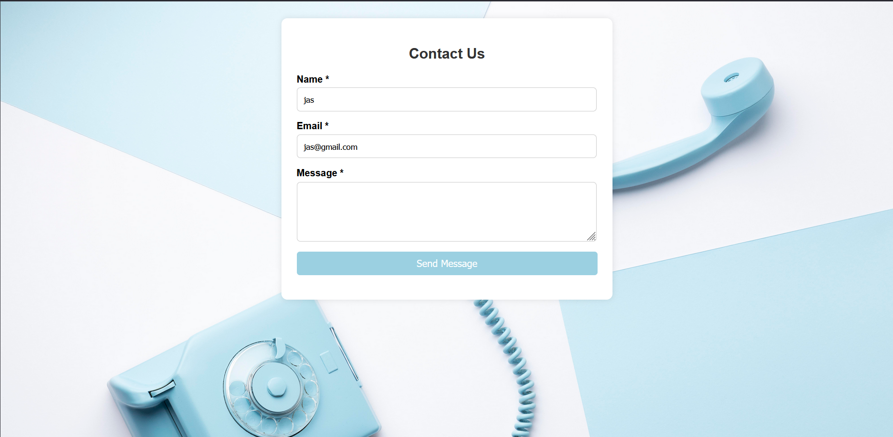

# 📬 **Contact Form with JavaScript Validation**

A clean and responsive **Contact Form** built using **HTML**, **CSS**, and **Vanilla JavaScript**. This form validates user input for **Name**, **Email**, and **Message** fields on the client side, ensuring users enter valid and complete information before submitting.

---

## ✅ **Features**

- 📝 **Form validation** for:
  - **Name**: Required, only letters and spaces
  - **Email**: Required, proper format (e.g., name@example.com)
  - **Message**: Required
- ❌ **Error messages** displayed for invalid inputs
- ✅ **Success message** on valid form submission
- 🔄 **Form reset** after successful submission
- 💡 **Responsive layout** with clean styling using CSS

---

## 💻 **Tech Used**

- **HTML5**
- **CSS3**
- **JavaScript (Vanilla)**

---

## ▶️ **How to Run**

1. **Download** or **clone** the repository  
2. Open the project folder in **VS Code**  
3. Open `index.html` in your **browser**  
   OR right-click the file in VS Code and select  
   `Open with Live Server` if the extension is installed  
4. Fill out the form and test:
   - Leave fields empty → see **error messages**
   - Use invalid email format → shows **email format warning**
   - Use numbers or symbols in the name field → **validation error**
   - Enter valid inputs → **success message is displayed** and form resets

---

