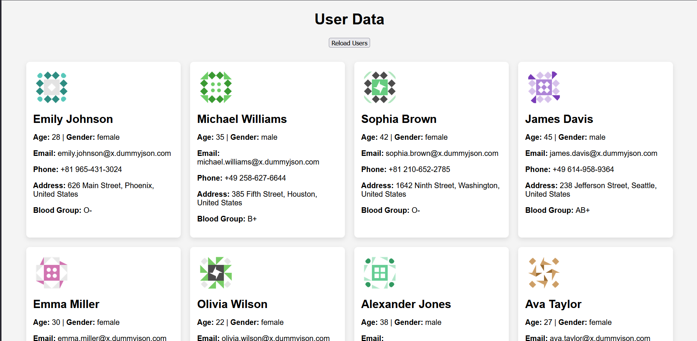
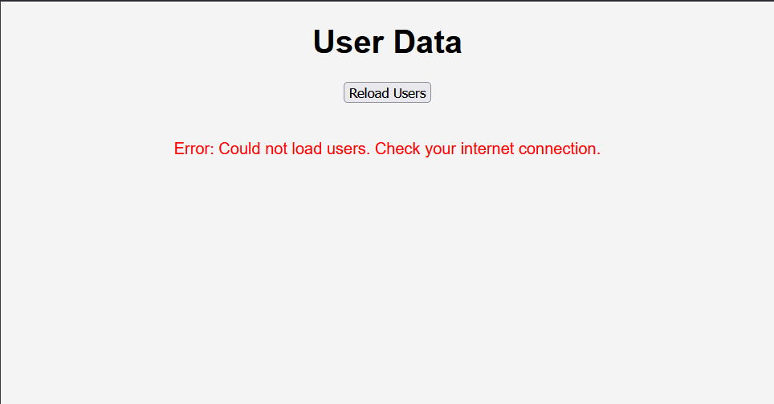

# 👥 Fetch and Display Users from DummyJSON API

This is a simple web application that uses the **JavaScript Fetch API** to retrieve user data from the public **DummyJSON Users API** and displays it dynamically on a webpage.

---

## 📌 Objective

- Learn to fetch data asynchronously using the Fetch API.
- Parse JSON responses.
- Display structured data in the browser using JavaScript.
- Handle errors and provide fallback UI messages.
- Understand basic DOM manipulation and event handling.

---

## 🔧 Tools Used

- HTML5
- CSS3
- JavaScript
- [DummyJSON Users API](https://dummyjson.com/users)

---

## 📷 Screenshot

 
 
<!-- Replace with your screenshot file if available -->

---

## 🚀 Features

- Fetches user data from an external API.
- Displays user info including:
  - Profile picture
  - Full name
  - Age and gender
  - Email and phone
  - Address
  - Blood group
- Handles and displays error messages if data fetch fails.
- Reload button to re-fetch and refresh user data.

---

## 🧪 How to Run

1. **Clone this repository** or download the files.

2. **Open `index.html` in your browser** (e.g., Chrome).

3. The app will automatically fetch and display users.  
   You can click **"Reload Users"** to fetch again.

---

